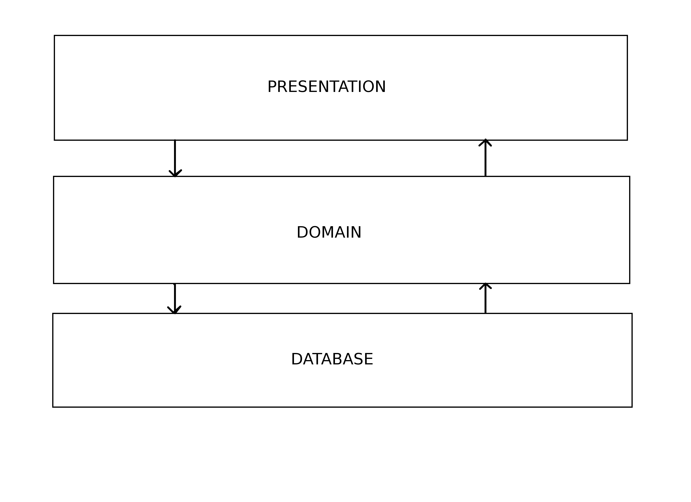
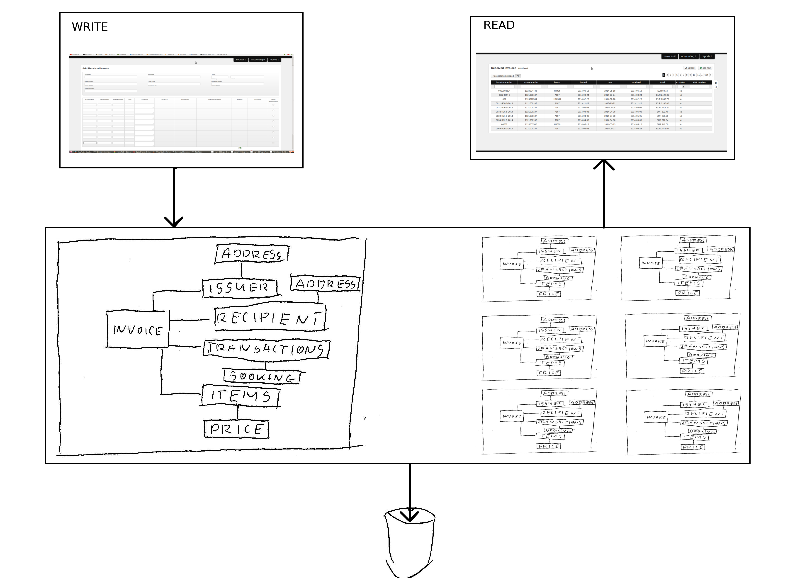
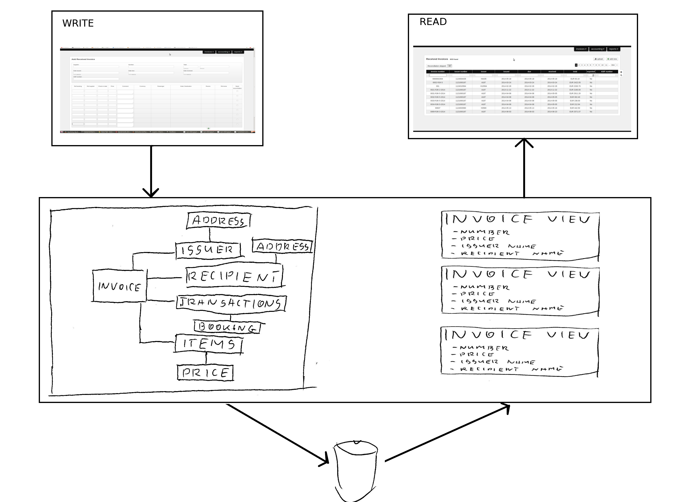
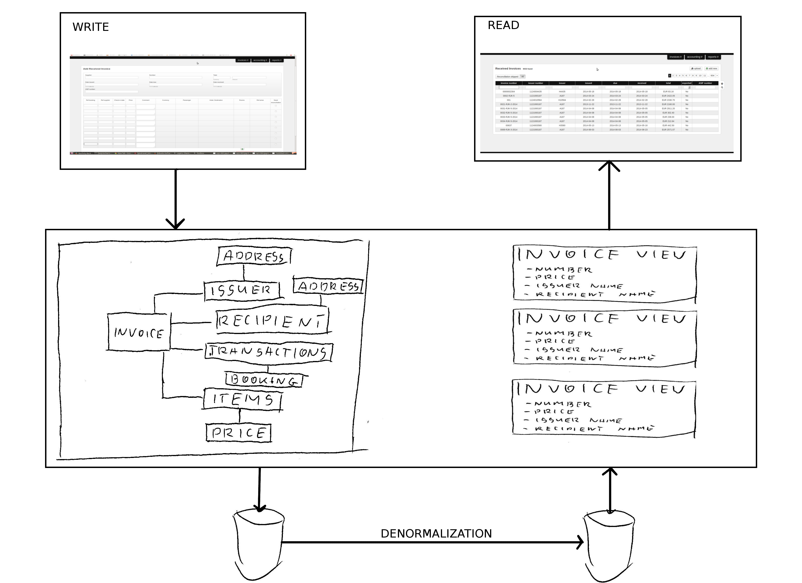
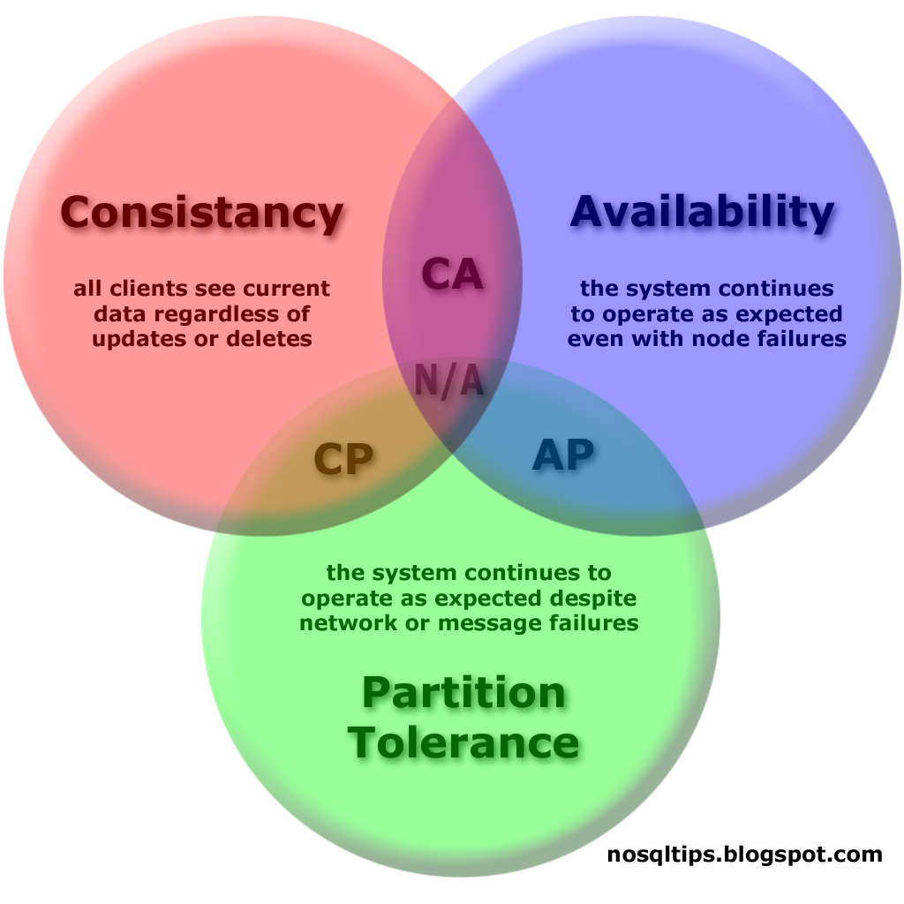
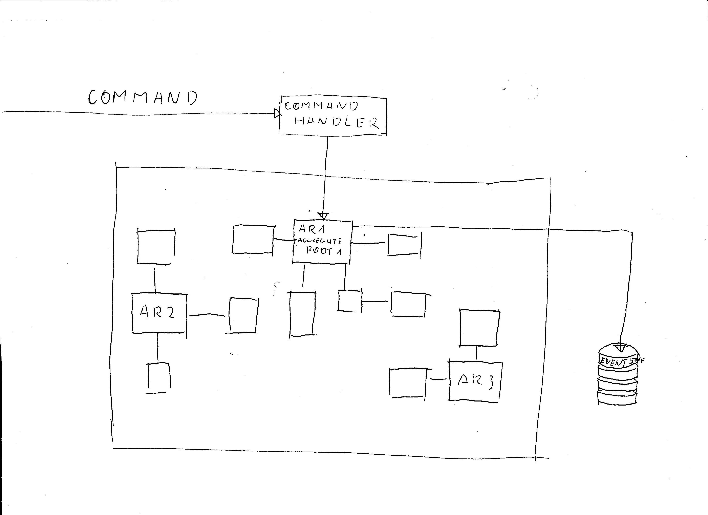
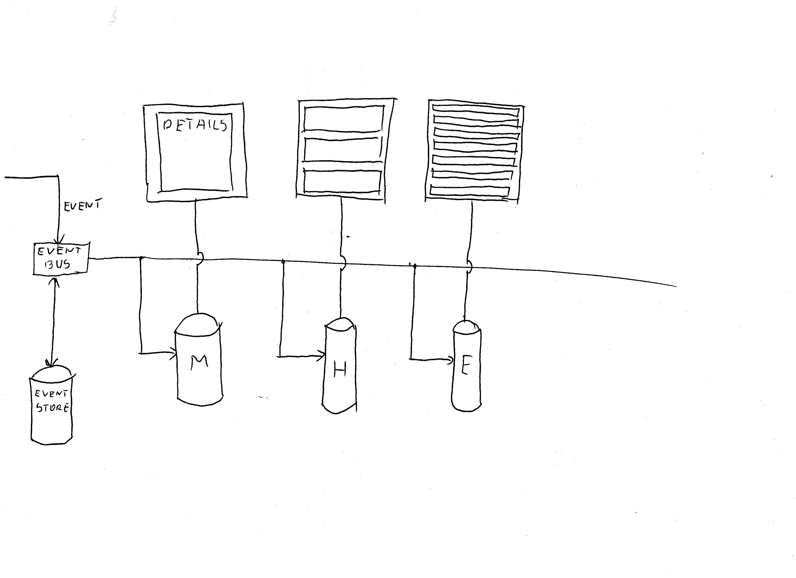

# CQRS + ES

!SLIDE top
## Command Query Responsibility Segregation
## Event Sourcing
### Moda czy konieczność?

!SLIDE left
## Co to jest?
#### CQRS - Command Query Responsibility Segregation
#### ES - Event Sourcing

!SLIDE left
## Terminologia
* Comand - komenda, polecenie zmieniające stan systemu
* Query - zapytanie zwracające dane, nie modyfikuje stanu systemu
* Aggregate - grupa obiektów tworzących całość
* Aggregate Root - obiekt stanowiący "punkt wejścia" do agregatu
* Event - zdarzenie, które zaszło

!SLIDE left
## Skądś to znamy
* Bazy danych: OLTP - OLAP
* Protokół HTTP: POST - GET

!SLIDE
## Czy w "zwykłych" aplikacjach też tak można?

!SLIDE
## Wspólny model

!SLIDE left
## Wspólny model
### zapis
* walidacja
* synchronizacja
* zwykle operuje na pojedynczym agregacie

### odczyt
* filtrowanie
* konwersja, "spłaszczanie" danych
* często operuje na wielu aggregatach (listy, raporty)

!SLIDE
## CQRS na poziomie modelu

!SLIDE left
## CQRS na poziomie modelu
* rozdzielnie zadań zapisu i odczytu
* uniknięcie tworzenia pełnego modelu gdy nie jest potrzebny
* widok konsumuje płaskie DTO (może wymagać konwersji danych)

!SLIDE
## CQRS na poziomie modelu i bazy danych

!SLIDE left
## CQRS na poziomie modelu i bazy danych
* schemat danych i technologia dostosowana do potrzeb
* skalowalność
* synchronizacja - AR callbacks, oplog, etc.

!SLIDE left
## Zalety
* uproszenie modeli
* wydajność i skalowalność

## Wady
* konieczność utrzymywania dwóch modeli
* duplikacja danych (wiele baz oraz denormalizacja)
* komplikacja infrastruktury
* synchronizacja danych i opóźnienia

!SLIDE
## Eventual consistency

#### "odporność na podział" kosztem spójności danych

!SLIDE left
## Event Sourcing
* bardzo często występuje razem z CQRS
* rozwiązuje inne problemy niż CQRS

!SLIDE left
## Problem trwałości danych
* transaction script
* active record
* object-relational mappings
* event sourcing

!SLIDE left
## Event Sourcing
* każda akcja domenowa powoduje wygenerowanie eventu (eventów)
* nie zapisujemy stanu obiektów (ORM) tylko historię zdarzeń (eventy)
* brak konieczności mapowań między strukturą eventów a schematem danych
* eventy są prostymi DTO
* nie można modyfikować eventów (tylko dodawać nowe)
* eventy mogą być dodatkowo przetwarzane przez domenę (i generować kolejne)

!SLIDE
## Event Sourcing

!SLIDE left
## Journaling
* stosowany w systemach plików i bazach danych

!SLIDE left
## Event Sourcing + CQRS
* command database - event store
* query database - database created from events

!SLIDE
## Event Sourcing - Queries

!SLIDE left
## Zalety
* brak powiązania obiektów domenowych i schematu danych
* brak konieczności konwersji danych przy zapisie
* luźno powiązane aggregaty
* pełna historia operacji (audit log)
* możliwość odtworzenia danych na podstawie eventów
* możliwość odtworzenia stanu danych z dowolnego momentu (reportowanie, analiza błędów)
* eventy można wyłącznie dodawać (prosta implementacja)

!SLIDE left
## Wady
* konieczność wersjonowania eventów i potencjalnych migracji
* skomplikowane, wiele interpretacji, chaos w nazewnictwie
* brak sprawdzonych narzędzi
* trudne do wdrożenia w istniejących aplikacjach
* powolne odtwarzanie stanu domeny (rozwiązanie - snapshoty)
* utrudniona analiza stanu danych w oparciu o eventy
* brak możliwości “ręcznych” poprawek danych

!SLIDE left
## Literatura
* http://msdn.microsoft.com/en-us/library/jj554200.aspx
* http://martinfowler.com/bliki/CQRS.html
* http://www.jayway.com/2013/03/08/aggregates-event-sourcing-distilled/
* http://www.slideshare.net/cavalle/the-cqrs-diet
* http://en.wikipedia.org/wiki/CAP_theorem
* http://martinfowler.com/eaaCatalog/

!SLIDE

# Dziękujemy
## mzaj & tedi

!NOTES
1) CQRS
- well known is some domains
        - data warehouses
        - HTTP protocol
- classic application (N - tier)
        - same model used for writing and querying
        - complex logic (reading needs different logic than writing, e.g. validation vs. filtering, BL vs. PL)
- CQRS in single application
        - no need to creating full domain model for displaying simple list
        - presentation objects consume simple DTOs (not complicated domain objects), sometimes it is not possible - we must use domain object for e.g. calculations (normalized db)
- separated database for writing and reading (denormalized)
        - scalability (Tedi wstawka)
        - database engine and data scheme optimal for its purpose
        - example implementation using AR triggers
- pros
        - separated models are simpler than one for both reading and writing
        - performance and scalability
- cons
        - data synchronization and propagation lags
        - not for operations that need both to modify and read data (hard to implement locking)
        - data duplication (two stored + denormalization)
        - more complicated infrastructure
        - need to maint dual models
- eventual consistency but partition tolerance (CAP theorem)

2) ES
- what it is
        - often connected with CQRS but they are two completely different things (however they fits)
        - way of storing domain date in persistent store
        - attacks same problem as ORM, AR, TS, etc. (persistence)
        - similar to ORM - domain logic is fully separated from persistence concerns
        - contrary to ORM no mapping between domain and store are needed
        - events used both for storing and domain objects (ARs) intercommunication (what is AR)
        - well known is some domains (DBs, filesystems)
        - how it cooperates with CQRS
        - Event Store (write DB)
        - events are simple DTO
- ES example image
        command -> c. handler -> AR -> events --> event bus --> AR
                                                            |-> Event store
- pros
        - keep models consistent
        - models loosely coupled
        - keep track of all changes
        - audit log (e.g. for accounting systems)
        - possibility to replay events thus reconstructing state of domain and read database read database (materialized view, aggregated events)
        - keep track of all changes in domain
        - easy to get state in any point in time (ease analysis and debugging, reporting)
        - events are immutable and append only
- cons
        - need to manage events versioning and migrations
        - hard to make manual changes in database (not good practice)
        - hard to introduce in legacy app
        - lack of proven tools (contrary to ORM)
        - complicated and not 'stable' (many interpretation + naming chaos)
        - performance (rebuilding domain may be time consuming), snapshots help
        - hard to query (CQRS and read database solved this problem)

3) Sources
http://msdn.microsoft.com/en-us/library/jj554200.aspx (CQRS Journey)
http://martinfowler.com/bliki/CQRS.html (Martin Fowler on CQRS)
http://www.jayway.com/2013/03/08/aggregates-event-sourcing-distilled/ (Minimalistic ES example)
http://www.slideshare.net/cavalle/the-cqrs-diet (CQRS Diet)
CAP theorem - wikipedia
http://martinfowler.com/eaaCatalog/ (Catalog of Patterns of Enterprise Application Architecture)
